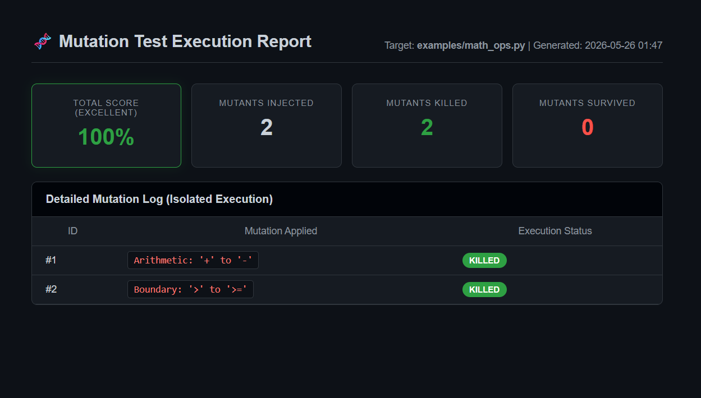
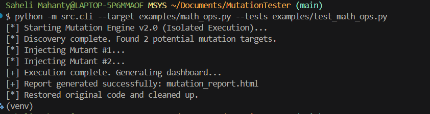
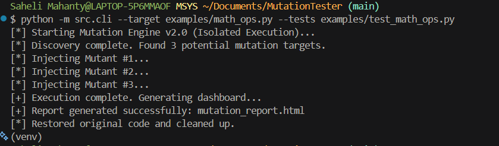

# 🧬 FaultForge: Automated Mutation Testing

> 🚀 FaultForge evaluates whether your tests truly detect real bugs—not just pass coverage checks.

Forge unbreakable code. A compiler-level Quality Assurance tool that uses Abstract Syntax Tree (AST) manipulation to inject isolated logical faults into Python codebases, exposing blind spots in your unit tests.

Rather than checking if your code works, this tool checks if your **tests actually catch when the code breaks**.

---

## 🚀 Features

* **AST Manipulation:** Uses Python's built-in `ast` module to safely inject logical mutations (e.g., `>` → `>=`)
* **Isolated Execution (v2.0):** Runs each mutation independently for accurate mutation scoring
* **Automated Evaluation:** Executes tests via `pytest` using `subprocess`
* **Failsafe Architecture:** Backup-restore pipeline ensures original code integrity
* **Insight Detection:** Highlights weak test cases and missing edge conditions

---

## ⚙️ How It Works

1. Parses source code into an Abstract Syntax Tree (AST)
2. Injects logical mutations (e.g., `>` → `>=`)
3. Executes test suite using `pytest`
4. Tracks which mutations are detected (killed) or missed (survived)
5. Generates mutation score + HTML dashboard

---

## 📊 Interactive Execution Dashboard

FaultForge generates a dynamic HTML report with mutation score, execution logs, and test weakness insights.

### ✅ Strong Test Case (All Mutants Killed)

### ⚠️ Weak Test Case (Survived Mutant Detected)


---

## 💻 CLI Output
## Killed Case

## Survived Case



# 🛠️ Installation & Setup
Clone the repository:

```
git clone [https://github.com/sahelidgp/FaultForge.git](https://github.com/sahelidgp/FaultForge.git)
cd FaultForge
```
Create and activate a virtual environment:

```
python -m venv venv
source venv/Scripts/activate  # Windows (Git Bash)
# source venv/bin/activate    # Mac/Linux
```
# Install dependencies:

```
pip install -r requirements.txt
```
# 💻 Usage
Run the CLI tool by passing it a target Python file and its corresponding test suite:

```
python -m src.cli --target examples/math_ops.py --tests examples/test_math_ops.py
```
# Expected Output:
The terminal will display the live, isolated execution loop. Upon completion, a mutation_report.html file will be generated in your root directory. Open it in any browser to view your test suite's official Mutation Score.


# 🎯 Why FaultForge?

 Traditional testing answers:

“Does the code work?”

FaultForge answers:

“Will your tests catch real bugs?”

It helps developers:

Identify weak or missing test cases
Detect boundary condition gaps
Avoid false confidence from passing tests

👉 Measures test effectiveness, not just coverage.

# 🔮 Future Improvements

 Support for multiple languages (C, Java)

 Advanced mutation operators
 CI/CD integration
 
 HTML → PDF report export
# 👩‍💻 Author
Saheli Mahanty 

 Computer Science & Engineering @ NIT Durgapur