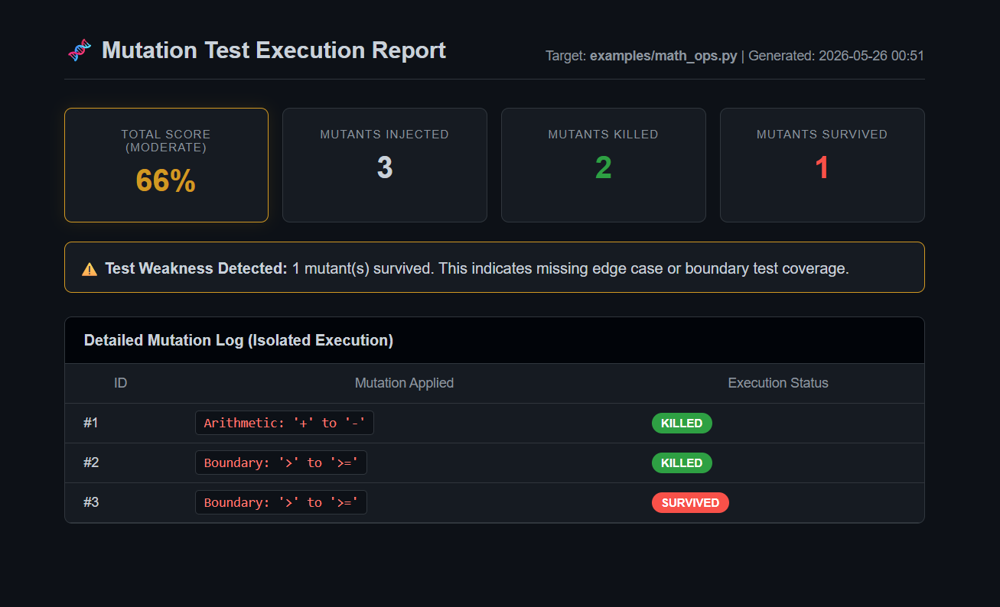

# 🧬 FaultForge: Automated Mutation Testing

Forge unbreakable code. A compiler-level Quality Assurance tool that uses Abstract Syntax Tree (AST) manipulation to inject isolated logical faults into Python codebases, exposing blind spots in your unit tests.

Rather than checking if your code works, this tool checks if your **tests actually catch when the code breaks**.

## 🚀 Features

* **AST Manipulation:** Utilizes Python's built-in `ast` module to deconstruct source code, safely inject logical mutations (e.g., swapping `>` for `>=`), and reconstruct the executable code.
* **Isolated Execution (v2.0):** Tests each mutation individually in a secure loop to generate granular, mathematically accurate mutation scores.
* **Automated Evaluation:** Leverages the `subprocess` module to spin up temporary test environments, run `pytest`, and evaluate mutant survival rates.
* **Failsafe Architecture:** Implements a strict backup-and-restore pipeline to guarantee original source code is preserved, even in the event of a runtime crash.

## 📊 Interactive Execution Dashboard

After executing the test suite, FaultForge automatically generates a dynamic HTML dashboard providing granular insights into mutant survival rates, boundary condition weaknesses, and overall test suite robustness.



## 📂 Architecture

This project is structured as a modular Python package for high maintainability and extensibility.

```text
FaultForge/
├── src/
│   ├── core/
│   │   ├── engine.py        # Subprocess and Pytest execution logic
│   │   └── ast_hacker.py    # NodeTransformer for isolated operator mutation
│   ├── reporters/
│   │   ├── console.py       # Terminal CLI output formatting
│   │   └── html_report.py   # Dynamic UI dashboard generator
│   └── cli.py               # Argument parsing and main execution loop
├── tests/                   # Unit tests verifying the internal mutator engine
├── examples/                # Sample targets and weak test suites for demonstration
└── assets/                  # Documentation images
```

# 🛠️ Installation & Setup
Clone the repository:

```
git clone [https://github.com/sahelidgp/FaultForge.git](https://github.com/sahelidgp/FaultForge.git)
cd FaultForge
```
Create and activate a virtual environment:

```
python -m venv venv
source venv/Scripts/activate  # Windows (Git Bash)
# source venv/bin/activate    # Mac/Linux
```
# Install dependencies:

```
pip install -r requirements.txt
```
# 💻 Usage
Run the CLI tool by passing it a target Python file and its corresponding test suite:

```
python -m src.cli --target examples/math_ops.py --tests examples/test_math_ops.py
```
# Expected Output:
The terminal will display the live, isolated execution loop. Upon completion, a mutation_report.html file will be generated in your root directory. Open it in any browser to view your test suite's official Mutation Score.

# 👩‍💻 Author
Saheli Mahanty 

 Computer Science & Engineering @ NIT Durgapur

